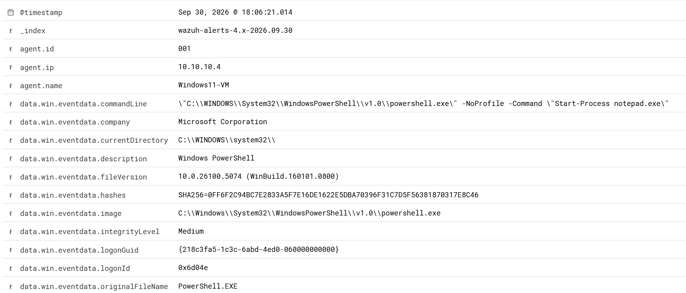

# Alert: Powershell process spawned Powershell instance

In this case, we investigate an alert provoked by a Powershell process spawning a Powershell instance. 

This is categorized as an Execution-type MITRE ATT&CK tactic.

## Context

Powershell is a built-in, in-memory capable program in Windows, so it can easily be exploited by attackers. A Powershell command inside the other could be an attempt to change the context of the exectution, like shifting to a different user, or generate obfuscation to delay the analysis and gain more time for the malicious purposes. 

Examples of risks include downloading an encoded payload that gets executed in-memory in Powershell, leading to ransomware or malware delivery, or stealing credentials and confidential data by breaking down the LSASS process into stages to make it vulnerable to reading. 

Since regular operations don't usually require this nested workflow, it is easy to flag as a risk.

## Analysis

The following image shows the description of the alert:

To figure out if this is a malicious event, the main fields we will pay attention to are the following:

| Field          | Content | Comments |
| ------------- | --------------- | ------------------ |
| Image       | "C:\\Windows\\System32\\WindowsPowerShell\\v1.0\\powershell.exe"      | It tells us the event ended up executing Powershell         |
| Command Line      | "\"C:\\WINDOWS\\System32\\WindowsPowerShell\\v1.0\\powershell.exe\" -NoProfile -Command \"Start-Process notepad.exe\""         | The line of code that was executed stated that Powershell should open and execute the last statement         |
| Parent Image          | "C:\\Windows\\System32\\WindowsPowerShell\\v1.0\\powershell.exe"           | The code itself was executed through Powershell         |
| User          | "WINDOWS11-VM\\jacr" | A known user |
| Event ID | 1 | Refers to Sysmon Process Create. It means a new process was started |
| Timestamp        | Sep 30, 2026 @ 18:06:21.014     | Events around this time are unrelated to this one         |

## Conclusion
Based on the event data, it is safe to assume this is a harmless, isolated event (provided it doesn't repeat in the near future).
