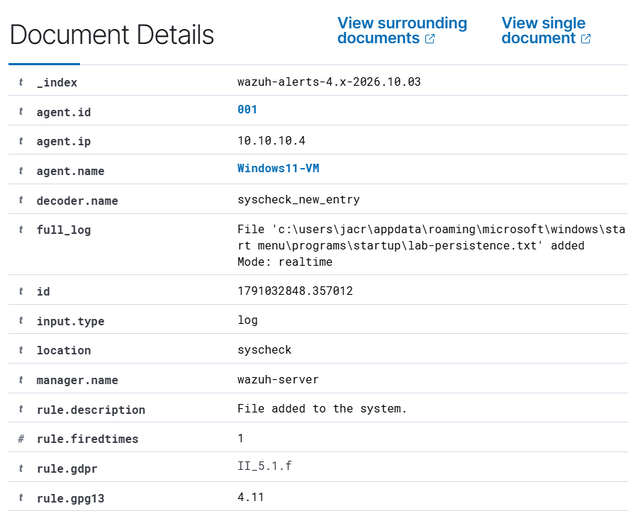

# Alert: Suspicious file in Startup folder

In this case, we investigate an alert provoked by a suspicious file getting added to the Startup folder of the Windows VM.

This could be categorized as a Persistencetype MITRE ATT&CK tactic, as it may tamper with the system during a restart.

## Context

Startup is a folder in Windows whose content runs automatically when a user signs in to a session. This means, any executable file inside it will start running after a restart, so the attacker can strategically place a malicious file to continue operating, even after the initial attack was contained. 

Any manipulation of this folder requires evaluation, to avoid repeatedly having to deal with attacks.

## Analysis

The following image shows the description of the alert:

We pay attention to the following fields:

- Path: "c:\users\jacr\appdata\roaming\microsoft\windows\start menu\programs\startup\lab-persistence.txt"
  - It tells us the file added to the path is a text file, not an executable file. This is a good sign.
 
- Rule ID: 554
  - It triggers when a new file is created inside a monitored (and therefore sensible) directory.
 
- Timestamp: Oct 3, 2026 @ 15:07:28.310
  - After that time, we got the alert that the file was deleted.
 
The file was a text file and later deleted, so the event seems harmless and under control. However, we still don't know where the file came from, and no alerts were triggered from it.

We now take a look at Wireshark to inspect our packet capture (PCAP) and determine whether the file came from a foreign device.

